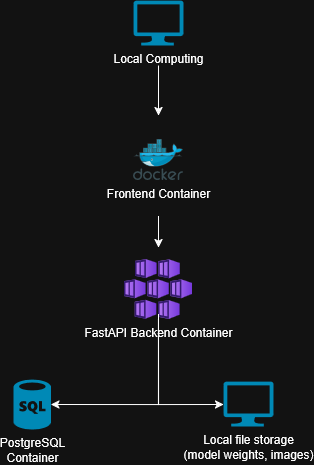
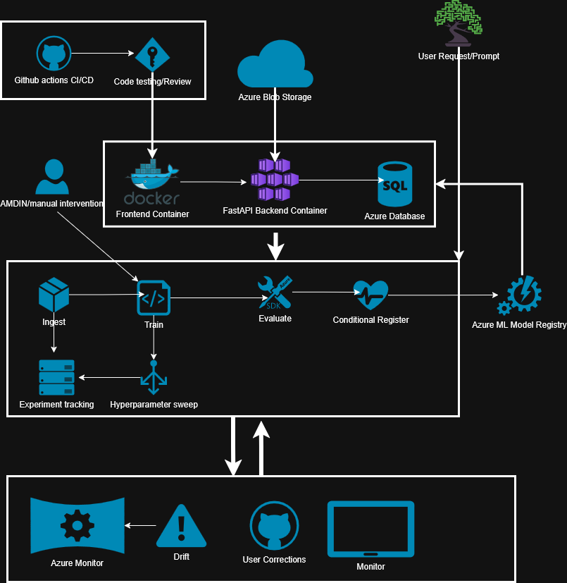

[](https://classroom.github.com/a/ZHpCIVQn)

# thalianacv <!-- omit in toc -->

<!-- TODO: Add a one or two sentence description of what this package does -->

---

## Table of contents <!-- omit from toc -->

- [Installation](#installation)
- [Usage](#usage)
- [Package Documentation](#package-documentation)
- [Data flow](#data-flow)
- [Development setup](#development-setup)
- [Running tests](#running-tests)

---

## Installation

<!-- TODO: Update once the package is published -->

```bash
pip install thalianacv
```

---

## Usage

<!-- TODO: Add usage examples once the package interface is defined -->

---

## Package Documentation

Thaliana CV Documentation can be found on [Github Sites](https://bredauniversityadsai.github.io/2025-26d-fai2-adsai-group-computervision8/)

---

## Data flow

### Local deployment (MLOps Level 1)
Core system running locally via Docker Compose - frontend, FastAPI backend, and PostgreSQL, with local model weights and image storage.



### On-premise deployment (MLOps Level 2–3)
Same stack deployed to the BUas server via Portainer, with Azure Blob Storage and Azure ML Model Registry for model and storage integration.

## Application On-Prem Deployment Information

Information regarding application deployment for on-prem running.

### Ports

Available Port Range: 2031-2035

| Service | Port |
|---------|------|
| API | 2031 |
| SQL | TBD |
| Front End | TBD |

The API docs are accessible at [194.171.191.226:2031/docs](http://194.171.191.226:2031/docs) when connected via VPN or on campus.


### Cloud deployment (MLOps Level 3–4)
Fully cloud-hosted system with CI/CD, automated retraining, MLflow tracking, and a user correction feedback loop.



## Development setup

This project requires Python 3.10 and uses [Poetry](https://python-poetry.org/) for dependency and virtual environment management.

### 1. Install Poetry

Do not install Poetry via pip. Use the official installer:

```bash
curl -sSL https://install.python-poetry.org | python3 -
```

Restart your terminal and verify:

```bash
poetry --version
```

### 2. Clone the repository and install dependencies

```bash
git clone git@github.com:BredaUniversityADSAI/2025-26d-fai2-adsai-group-computervision8.git
cd thalianacv
poetry install
```

### 3. Install pre-commit hooks

```bash
poetry run pre-commit install
```

Pre-commit will now run automatically on every commit, checking formatting and code style before the commit is accepted.

---

## Running tests

```bash
poetry run pytest tests/ -v
```

All tests must pass before opening a pull request.

For contributing guidelines, branch naming conventions, and code standards, see [CONTRIBUTING.md](CONTRIBUTING.md).

